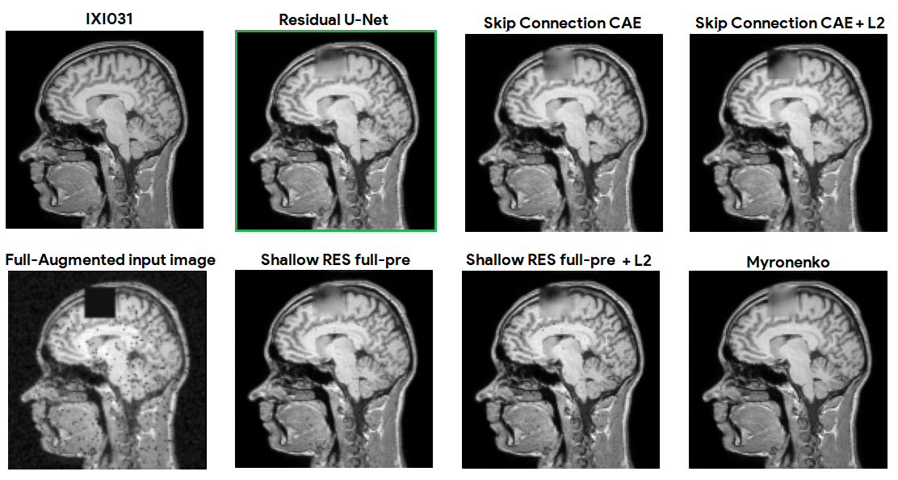
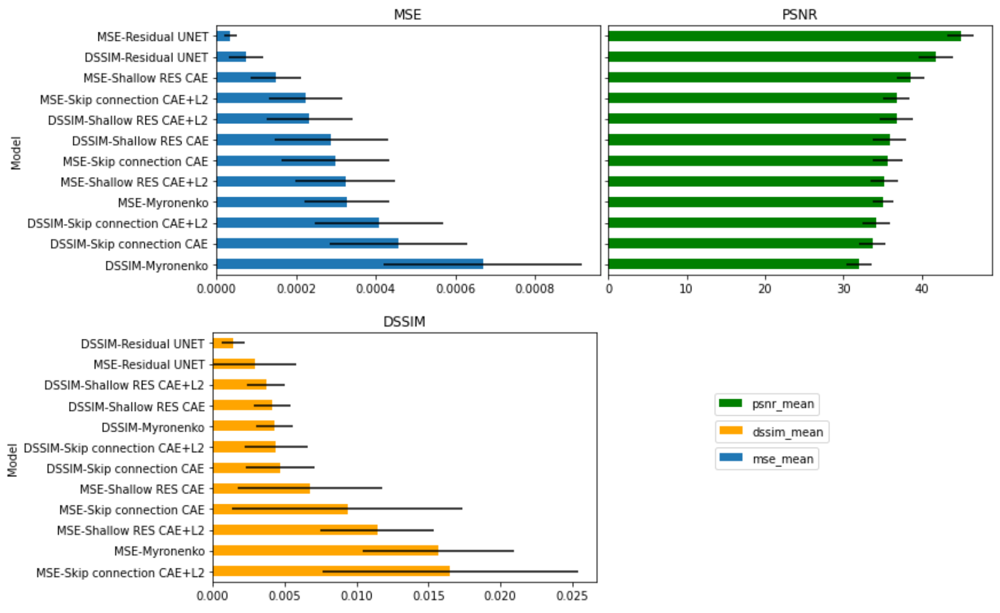
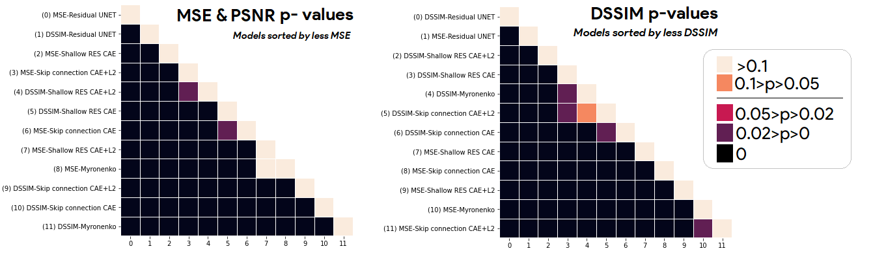

Brain-MRI-Autoencoder
=

###### Deep Autoencoder for brain MRI

***********

**Master's Thesis. Master's in Data Science at Universitat Oberta de Catalunya.**

#### Author
* **Adrián Arnaiz Rodríguez** - [aarnaizr@uoc.edu](mailto:aarnaizr@uoc.edu)

#### Tutor: 
* **Dr. Baris Kanber** - [bkanber@uoc.edu](mailto:bkanber@uoc.edu)

***************
## Convolutional Autoencoder Architectures used

#### Experiments:
* **With Data Augmentation**:
    * ***2 experiments (MSE and DSSIM Loss) for each of the following architectures:***
        * Shallow residual autoencoder (full-pre)
        * Shallow residual autoencoder (full-pre) + L2 reg.
        * Skip connection autoencoder
        * Skip connection autoencoder + L2 reg.
        * Myronenko Autoencoder
        * **RESIDUAL-UNET** (proposed new improved architecture)

* Without Data Augmentation:
    * MSE Loss
        * Shallow residual autoencoder (original)
        * Shallow residual autoencoder (full-pre)
        * Shallow residual autoencoder (full-pre) + L2 reg.
        * Skip connection autoencoder
        * Myronenko Autoencoder
        * Myronenko Autoencoder + L2 reg.

***************
## Results
### Quantitative Results
| Model                 | **loss**         | **L2**         | **Val loss**           | **MSE**                                     | **DSSIM**                                     | **PSNR**  |
|-----------------------|------------------|----------------|------------------------|---------------------------------------------|-----------------------------------------------|-------------------|
| **Residual U-NET**       | *MSE*              | *No*             | **3.58e-05**         | ***3.44e-05***                            | **2.95e-03**                                | **44.9**         |
| **Shallow RES full-pre** | *MSE*              | *No*             | 1.55e-04             | *1.51e-04*                             | 6.75e-03                                    | 38.6             |
| **Skip connection CAE**   | *MSE*              | *Yes*            | 2.69e-04             | *2.25e-04*                              | 1.65e-02                                    | 36.8             |
| **Skip connection CAE**  | *MSE*              | *No*             | 3.10e-04             | *2.99e-04*                              | 9.36e-03                                    | 35.7             |
| **Myronenko CAE**         | *MSE*              | *No*             | 3.38e-04             | *3.27e-04*                              | 1.57e-02                                    | 35.1             |
| **Shallow RES full-pre** | *MSE*              | *Yes*            | 3.72e-04             | *3.24e-04*                             | 1.14e-02                                    | 35.2             |
| **Residual U-NET**       | *DSSIM*            | *No*             | **1.50e-03**         | **7.49e-05**                              | ***1.44e-03***                               | **41.8**         |
| **Shallow RES full-pre** | *DSSIM*            | *Yes*            | 4.42e-03             | 2.34e-04                                  | *3.70e-03*                                | 36.7             |
| **Shallow RES full-pre** | *DSSIM*            | *No*             | 4.19e-03             | 2.88e-04                                  | *4.14e-03*                                | 35.9             |
| **Myronenko CAE**         | *DSSIM*            | *No*             | 4.39e-03             | 6.69e-04                                  | *4.31e-03*                                | 32.1             |
| **Skip connection CAE**  | *DSSIM*            | *Yes*            | 4.82e-03             | 4.08e-04                                  | *4.38e-03*                                | 34.2             |
| **Skip connection CAE**   | *DSSIM*            | *No*             | 4.90e-03             | 4.57e-04                                  | *4.71e-03*                                | 33.7             |

### Quanlitative Results

### Char of test metrics and dependent sample t-test significances

